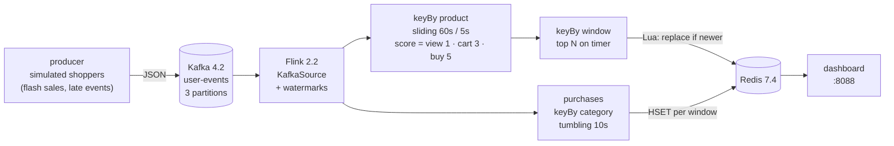

<div align="center">

# flink-kafka-redis-demo

**Real-time trending products and GMV with Kafka, Flink 2 and Redis — one `docker compose up` away.**

[](https://github.com/tomdong2010/flink-kafka-redis-demo/actions/workflows/ci.yml)
[](https://flink.apache.org)
[](https://kafka.apache.org)
[](https://redis.io)
[](pom.xml)
[](LICENSE)

English | [简体中文](README.zh-CN.md)


</div>

A simulated shop streams clicks, add-to-carts and purchases into Kafka. A Flink job turns them into
two results:
- **the top 10 trending products of the last minute**, updated every 5 seconds;
- **revenue per category every 10 seconds**.

It writes both to Redis, and a small web page shows them live.

It is small enough to read in an evening, but it handles the things real streaming jobs get wrong:

| | What it shows | Where |
|---|---|---|
| ⏱ | **Event time and watermarks**: out-of-order events land in the right window; events that are too late are dropped and counted | [`TrendingJob`](src/main/java/io/github/tomdong2010/fkr/job/TrendingJob.java) |
| 🔥 | **Sliding-window top N** ("hot items"): incremental aggregation, then a keyed timer ranks each window once it is complete | [`TopNFunction`](src/main/java/io/github/tomdong2010/fkr/job/TopNFunction.java) |
| ♻️ | **Effectively exactly-once results in Redis**: an at-least-once sink flushed on checkpoints, plus idempotent writes | [`RedisSink`](src/main/java/io/github/tomdong2010/fkr/redis/RedisSink.java) |
| ⏭ | **Never goes backwards**: a Lua script rejects a window older than the one stored, even after a replay | [`TrendingWriter`](src/main/java/io/github/tomdong2010/fkr/redis/TrendingWriter.java) |
| ☠️ | **Poison records** are skipped and counted (`malformedEvents`) instead of crash-looping the job | [`UserEventDeserializer`](src/main/java/io/github/tomdong2010/fkr/serde/UserEventDeserializer.java) |
| 💾 | **Checkpoints and recovery**: kill the TaskManager and the job resumes where it stopped | [`docker-compose.yml`](docker-compose.yml) |
| 🧱 | **Flink 2 APIs**: `KafkaSource`, Sink V2, `Duration`-based windows, stable operator `uid`s for savepoints | |
| 📊 | **Live dashboard** with no external JS or CDN, served from the same jar | [`index.html`](src/main/resources/dashboard/index.html) |
| ✅ | **Tests**: the real pipeline on a Flink MiniCluster, Redis via Testcontainers, and an end-to-end smoke test in CI | [`src/test`](src/test/java/io/github/tomdong2010/fkr) |

## Architecture



## Quick start

All you need is Docker. The stack uses about 2 GB of memory; give Docker at least 4 GB.

```shell
git clone https://github.com/tomdong2010/flink-kafka-redis-demo && cd flink-kafka-redis-demo
docker compose up -d --build
```

After a minute or so:

- **Dashboard**: http://localhost:8088. The leaderboard reshuffles every 5 seconds, and every 20
  seconds a new "flash sale" pushes a random product to the top.
- **Flink Web UI**: http://localhost:8081 shows the job graph, checkpoints, watermarks and metrics.
- `scripts/smoke-test.sh` checks the whole pipeline end to end.


### Things to try

| Try | Command | What you should see |
|---|---|---|
| Crash a worker | `make restart-taskmanager` | The job restores its last checkpoint in about 15 s. Events that queued up in Kafka meanwhile are processed into the right windows, so the charts have no gap. |
| Send a poison record | `make poison` | The job keeps running, and `malformedEvents` goes up in the Flink UI (source operator → Metrics). |
| Watch late data | Flink UI → `category-revenue` → Metrics → `numLateRecordsDropped` | About 5% of events are sent up to 15 s late. Those later than the 5 s watermark bound, whose windows have already closed, are dropped. |
| More traffic | `EVENTS_PER_SECOND=500 docker compose up -d producer` | Scores and throughput go up; latency stays the same. |
| Browse Kafka | `docker compose --profile ui up -d` | Kafka UI on http://localhost:8080. |
| Look at Redis | `docker compose exec redis redis-cli ZREVRANGE "{trending}:products" 0 9 WITHSCORES` | The leaderboard that the dashboard reads. |

`make down` stops everything and deletes the volumes.

## How it works

<details open>
<summary><b>Event time, watermarks and late data</b></summary>

Every event carries the time it happened. The source uses
`WatermarkStrategy.forBoundedOutOfOrderness(5s)`: the job waits up to 5 seconds for stragglers
before closing a window, so out-of-order events still count.

The producer deliberately sends 5% of events up to 15 seconds late. Those later than the
watermark bound are dropped by the window operator and counted in its `numLateRecordsDropped`
metric. `withIdleness(30s)` stops an empty partition from holding the watermark back.
</details>

<details>
<summary><b>Top N over a sliding window (the "hot items" pattern)</b></summary>

1. `keyBy(productId)` → `SlidingEventTimeWindows.of(60s, 5s)` → `aggregate(ScoreAggregate, …)`.
   The aggregate keeps a single `long` per product and window instead of buffering events.
2. `keyBy(windowEnd)` → `TopNFunction` collects every product's score for that window in
   `ListState` and registers an event-time timer at `windowEnd`.
3. The timer fires once the watermark passes the window end, which means every score for that
   window has arrived. The function sorts the scores, emits the top N and clears its state.
</details>

<details>
<summary><b>Why the Redis results are correct after a failure</b></summary>

- `RedisSink` implements Flink's Sink V2 API. It pipelines commands and sends them on every
  checkpoint (`flush`), so a checkpoint only completes after its results are in Redis. That is
  **at-least-once**.
- After a failure, Flink rewinds to the last checkpoint and replays from there, so some results
  are written twice. Every write is **idempotent**: absolute values with `HSET`, `ZADD` and
  `SET`, never `INCR`. Writing a result twice leaves the same state, so the outcome is
  effectively exactly-once.
- The leaderboard is replaced by a **Lua script**:
  - it runs atomically, so readers never see a half-written board;
  - it refuses a window older than the one stored, so neither a replay nor two parallel
    subtasks finishing out of order can move the board backwards.
- Keys that change together share a hash tag (`{trending}`), so the script also works on Redis
  Cluster.
</details>

<details>
<summary><b>Operational details</b></summary>

- The job runs in **Application mode**: the JobManager starts `TrendingJob` from the jar in
  `/opt/flink/usrlib`.
- The producer and the dashboard use the same image and the Flink libraries already in it, so
  there is a single Docker image and no extra logging jars.
- A checkpoint is taken every 10 s to a volume shared by the JobManager and the TaskManager.
  Checkpoints are kept when the job is cancelled.
- Every operator has a stable `uid`, so the pipeline can change without losing savepoint state.
- Consumer offsets are committed on checkpoints. A fresh job starts at the tail of the topic; a
  restarted one resumes from its checkpoint.
</details>

## Configuration

Settings are environment variables. The defaults work for running locally:

| Variable | Default | Used by | Description |
|---|---|---|---|
| `KAFKA_BOOTSTRAP_SERVERS` | `localhost:9092` | all | Kafka brokers (`EXAMPLE_KAFKA_SERVER` still works) |
| `KAFKA_TOPIC` | `user-events` | all | Topic (`EXAMPLE_KAFKA_TOPIC` still works) |
| `KAFKA_GROUP_ID` | `flink-trending` | job | Consumer group for committed offsets |
| `REDIS_HOST` / `REDIS_PORT` | `localhost` / `6379` | job, dashboard | Redis |
| `TOP_N` | `10` | job | Size of the leaderboard |
| `TRENDING_WINDOW` / `TRENDING_SLIDE` | `60s` / `5s` | job | Sliding window for the leaderboard |
| `GMV_WINDOW` | `10s` | job | Tumbling window for revenue |
| `MAX_OUT_OF_ORDERNESS` | `5s` | job | Watermark bound |
| `CHECKPOINT_INTERVAL` | `10s` | job | Checkpoint interval |
| `EVENTS_PER_SECOND` | `50` | producer | Simulated traffic |
| `LATE_EVENT_RATIO` | `0.05` | producer | Share of events sent up to 15 s late |
| `DASHBOARD_PORT` | `8088` | dashboard | HTTP port |

Durations accept `ms`, `s`, `m` and `h`.

## Development

```shell
mvn verify    # unit tests + Flink MiniCluster pipeline test + Redis tests (Testcontainers, needs Docker)
```

To run the job from an IDE:
1. Start Kafka and Redis with `docker compose up -d kafka redis`.
2. Run `io.github.tomdong2010.fkr.Main job`. Flink is a `provided` dependency, so enable "include
   dependencies with provided scope" in the run configuration.
3. Start `Main producer` and `Main dashboard` the same way.

```
src/main/java/io/github/tomdong2010/fkr/
├── producer/    EventGenerator (flash sales, late events), EventProducer (idempotent Kafka producer)
├── job/         TrendingJob pipeline, ScoreAggregate, TopNFunction, RevenueAggregate
├── redis/       RedisSink (Sink V2), TrendingWriter (Lua), RevenueWriter, RedisKeys
├── dashboard/   DashboardServer (JDK HTTP server) + resources/dashboard/index.html
├── serde/       JSON and the fault-tolerant Kafka deserializer
└── model/       UserEvent, ProductScore, TopProducts, CategoryRevenue, Catalog
```

## Roadmap

- [ ] The same pipeline in Flink SQL, side by side with the DataStream version
- [ ] Prometheus + Grafana for Flink metrics (lag, checkpoint duration, late records)
- [ ] Deployment with the Flink Kubernetes Operator
- [ ] Unique visitors per product with HyperLogLog

Ideas and pull requests are welcome; see [CONTRIBUTING.md](CONTRIBUTING.md).

## Acknowledgements and license

Originally based on [davidcampos/kafka-spark-flink-example](https://github.com/davidcampos/kafka-spark-flink-example).
Version 2 is a rewrite focused on Flink; see [CHANGELOG.md](CHANGELOG.md). Released under the [MIT License](LICENSE).

<div align="center">

If this helped you learn Flink, a ⭐ helps others find it.

</div>
