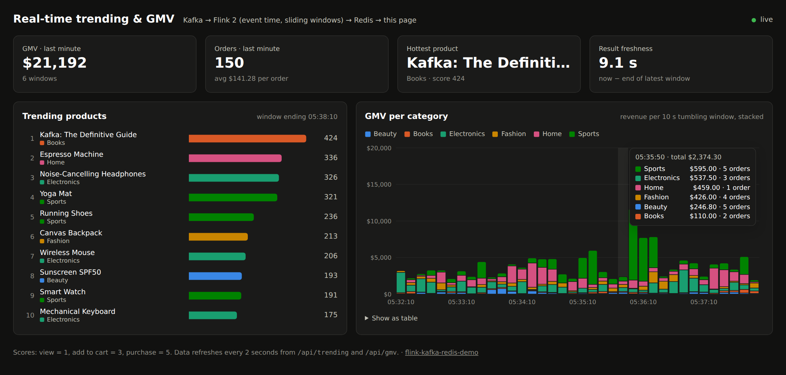
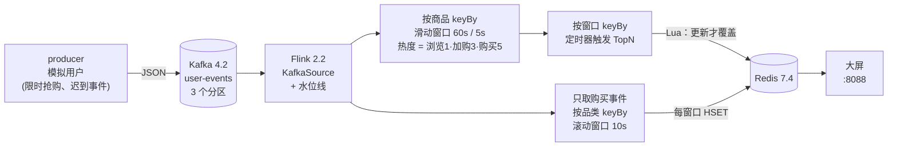
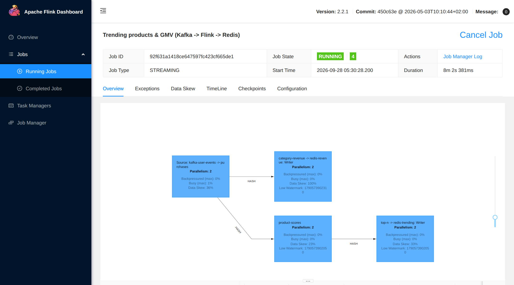

<div align="center">

# flink-kafka-redis-demo

**Kafka + Flink 2 + Redis 实时热门商品 TopN 与 GMV 大屏：一条 `docker compose up` 即可运行。**

[](https://github.com/tomdong2010/flink-kafka-redis-demo/actions/workflows/ci.yml)
[](https://flink.apache.org)
[](https://kafka.apache.org)
[](https://redis.io)
[](pom.xml)
[](LICENSE)

[English](README.md) | 简体中文



</div>

一个模拟商城把浏览、加购、下单事件持续写入 Kafka。Flink 作业据此计算两类结果：
- **最近 1 分钟的热门商品 Top 10**，每 5 秒更新一次；
- **每 10 秒各品类的成交额（GMV）**。

结果写入 Redis，再由一个小网页实时展示。

项目小到一个晚上就能读完，但实时计算里最容易出错的地方都覆盖到了：

| | 演示内容 | 代码位置 |
|---|---|---|
| ⏱ | **事件时间与水位线**：乱序事件照样落入正确的窗口；超出容忍范围的迟到事件会被丢弃并计数 | [`TrendingJob`](src/main/java/io/github/tomdong2010/fkr/job/TrendingJob.java) |
| 🔥 | **滑动窗口 TopN（经典"实时热门商品"）**：先增量聚合，再用定时器在窗口数据到齐后统一排序 | [`TopNFunction`](src/main/java/io/github/tomdong2010/fkr/job/TopNFunction.java) |
| ♻️ | **Redis 结果等效精确一次**：checkpoint 时刷写的至少一次 Sink，加上幂等写入 | [`RedisSink`](src/main/java/io/github/tomdong2010/fkr/redis/RedisSink.java) |
| ⏭ | **榜单只进不退**：Lua 脚本拒绝写入比现有结果更旧的窗口，重放时也一样 | [`TrendingWriter`](src/main/java/io/github/tomdong2010/fkr/redis/TrendingWriter.java) |
| ☠️ | **毒消息容错**：解析失败的消息跳过并计入 `malformedEvents`，不会让作业陷入反复崩溃重启 | [`UserEventDeserializer`](src/main/java/io/github/tomdong2010/fkr/serde/UserEventDeserializer.java) |
| 💾 | **Checkpoint 与故障恢复**：杀掉 TaskManager，作业会从断点继续 | [`docker-compose.yml`](docker-compose.yml) |
| 🧱 | **Flink 2 新 API**：`KafkaSource`、Sink V2、基于 `Duration` 的窗口、为 savepoint 设置固定的算子 `uid` | |
| 📊 | **实时大屏**：不依赖任何外部 JS 或 CDN（国内网络也能正常打开），和作业打在同一个 jar 里 | [`index.html`](src/main/resources/dashboard/index.html) |
| ✅ | **测试**：在 Flink MiniCluster 上跑真实管道，用 Testcontainers 起 Redis，CI 里还有端到端冒烟测试 | [`src/test`](src/test/java/io/github/tomdong2010/fkr) |

## 架构



## 快速开始

只需要 Docker。整套环境实际约占 2 GB 内存，建议给 Docker 分配 4 GB 以上。

```shell
git clone https://github.com/tomdong2010/flink-kafka-redis-demo && cd flink-kafka-redis-demo
docker compose up -d --build
```

大约一分钟后：

- **实时大屏**：http://localhost:8088 。排行榜每 5 秒刷新一次，每 20 秒会有一个随机商品开始"限时抢购"并冲上榜首。
- **Flink Web UI**：http://localhost:8081 ，可以查看作业拓扑、checkpoint、水位线和各项指标。
- 运行 `scripts/smoke-test.sh` 可以对整条链路做端到端检查。



### 可以动手试试

| 试验 | 命令 | 预期现象 |
|---|---|---|
| 让工作节点崩溃 | `make restart-taskmanager` | 约 15 秒后作业从最近的 checkpoint 恢复。停机期间积压在 Kafka 里的事件按事件时间补算进正确的窗口，图表不会出现断档。 |
| 发送一条毒消息 | `make poison` | 作业照常运行，Flink UI 中数据源算子的 Metrics 里，`malformedEvents` 加 1 |
| 观察迟到数据 | Flink UI → `category-revenue` → Metrics → `numLateRecordsDropped` | 约 5% 的事件会迟到最多 15 秒。晚于 5 秒水位线容忍度、且所属窗口已关闭的事件会被丢弃。 |
| 加大流量 | `EVENTS_PER_SECOND=500 docker compose up -d producer` | 热度分数和吞吐量上升，延迟不变 |
| 查看 Kafka | `docker compose --profile ui up -d` | Kafka UI 在 http://localhost:8080 |
| 查看 Redis | `docker compose exec redis redis-cli ZREVRANGE "{trending}:products" 0 9 WITHSCORES` | 大屏读取的排行榜数据 |

`make down` 会停止全部服务并删除数据卷。

## 原理说明

<details open>
<summary><b>事件时间、水位线与迟到数据</b></summary>

每条事件都带有它实际发生的时间。数据源使用 `WatermarkStrategy.forBoundedOutOfOrderness(5s)`：
关闭窗口前最多等待 5 秒的迟到数据，所以乱序事件也能被正确统计。

生产者会故意让 5% 的事件迟到最多 15 秒。超出水位线容忍度的事件会被窗口算子丢弃，并记入 `numLateRecordsDropped` 指标。
`withIdleness(30s)` 则保证某个分区暂时没有数据时，不会拖住整体水位线。
</details>

<details>
<summary><b>滑动窗口 TopN（"实时热门商品"模式）</b></summary>

1. `keyBy(productId)` → `SlidingEventTimeWindows.of(60s, 5s)` → `aggregate(ScoreAggregate, …)`：
   每个商品在每个窗口只保存一个 `long`，不缓存原始事件。
2. `keyBy(windowEnd)` → `TopNFunction` 把同一窗口所有商品的分数收集到 `ListState`，并在 `windowEnd` 注册事件时间定时器。
3. 水位线越过窗口结束时间时定时器触发，此时该窗口的所有分数都已到齐。函数排序后输出前 N 名，并清空状态。
</details>

<details>
<summary><b>为什么故障后 Redis 里的结果仍然正确</b></summary>

- `RedisSink` 实现了 Flink 的 Sink V2 接口，用 pipeline 批量发送命令。每次 checkpoint 都会刷写（`flush`），所以 checkpoint 只有在结果真正写入 Redis 后才算完成，这就是**至少一次**语义。
- 故障后 Flink 会回退到最近的 checkpoint 并重放，同一个结果可能被写两次。所以每次写入都是**幂等**的：只用 `HSET`、`ZADD`、`SET` 写绝对值，从不用 `INCR`。重复写入后状态不变，整体效果等同于精确一次。
- 排行榜通过 **Lua 脚本**整体替换：
  - 脚本原子执行，读者不会看到只写了一半的榜单；
  - 比已存窗口更旧的结果会被拒绝，无论是故障重放还是并行子任务乱序完成，榜单都不会倒退。
- 一起变化的 key 使用同一个 hash tag（`{trending}`），脚本在 Redis Cluster 上也能正常运行。
</details>

<details>
<summary><b>部署细节</b></summary>

- 作业以 **Application 模式**运行：JobManager 直接从 `/opt/flink/usrlib` 下的 jar 启动 `TrendingJob`。
  producer 和大屏复用同一个镜像，以及镜像里自带的 Flink 依赖库，所以整个项目只有一个 Docker 镜像，也不需要额外的日志 jar。
- 每 10 秒做一次 checkpoint，写入 JobManager 与 TaskManager 共享的数据卷，作业取消后仍会保留。
- 每个算子都有固定的 `uid`，以后修改管道时不会丢失 savepoint 中的状态。
- 消费位点在 checkpoint 时提交。全新启动的作业从 topic 末尾开始消费，重启的作业从 checkpoint 处继续。
</details>

## 配置

通过环境变量配置，默认值适合本地运行：

| 变量 | 默认值 | 使用方 | 说明 |
|---|---|---|---|
| `KAFKA_BOOTSTRAP_SERVERS` | `localhost:9092` | 全部 | Kafka 地址（兼容旧的 `EXAMPLE_KAFKA_SERVER`） |
| `KAFKA_TOPIC` | `user-events` | 全部 | Topic（兼容旧的 `EXAMPLE_KAFKA_TOPIC`） |
| `KAFKA_GROUP_ID` | `flink-trending` | 作业 | 提交位点使用的消费者组 |
| `REDIS_HOST` / `REDIS_PORT` | `localhost` / `6379` | 作业、大屏 | Redis 地址 |
| `TOP_N` | `10` | 作业 | 排行榜长度 |
| `TRENDING_WINDOW` / `TRENDING_SLIDE` | `60s` / `5s` | 作业 | 排行榜使用的滑动窗口大小 / 滑动步长 |
| `GMV_WINDOW` | `10s` | 作业 | GMV 使用的滚动窗口大小 |
| `MAX_OUT_OF_ORDERNESS` | `5s` | 作业 | 水位线乱序容忍度 |
| `CHECKPOINT_INTERVAL` | `10s` | 作业 | checkpoint 间隔 |
| `EVENTS_PER_SECOND` | `50` | producer | 每秒模拟的事件数 |
| `LATE_EVENT_RATIO` | `0.05` | producer | 迟到事件比例（最多迟到 15 秒） |
| `DASHBOARD_PORT` | `8088` | 大屏 | HTTP 端口 |

时长支持 `ms`、`s`、`m`、`h` 后缀。

## 开发

```shell
mvn verify    # 单元测试 + Flink MiniCluster 管道测试 + Redis 测试（Testcontainers，需要 Docker）
```

在 IDE 中运行作业：
1. 先用 `docker compose up -d kafka redis` 启动 Kafka 和 Redis；
2. 运行 `io.github.tomdong2010.fkr.Main job`。Flink 依赖是 `provided` 作用域，需要在运行配置里勾选 "include dependencies with provided scope"；
3. `Main producer` 和 `Main dashboard` 用同样的方式启动。

```
src/main/java/io/github/tomdong2010/fkr/
├── producer/    EventGenerator（限时抢购、迟到事件）、EventProducer（幂等 Kafka 生产者）
├── job/         TrendingJob 管道、ScoreAggregate、TopNFunction、RevenueAggregate
├── redis/       RedisSink（Sink V2）、TrendingWriter（Lua）、RevenueWriter、RedisKeys
├── dashboard/   DashboardServer（JDK 内置 HTTP 服务）+ resources/dashboard/index.html
├── serde/       JSON 与容错的 Kafka 反序列化器
└── model/       UserEvent、ProductScore、TopProducts、CategoryRevenue、Catalog
```

## 路线图

- [ ] 用 Flink SQL 实现同样的管道，与 DataStream 版本对照
- [ ] 用 Prometheus + Grafana 监控 Flink 指标（延迟、checkpoint 耗时、迟到数据）
- [ ] 用 Flink Kubernetes Operator 部署
- [ ] 用 HyperLogLog 统计每个商品的独立访客数

欢迎提想法和 PR，详见 [CONTRIBUTING.md](CONTRIBUTING.md)。

## 致谢与许可证

最初基于 [davidcampos/kafka-spark-flink-example](https://github.com/davidcampos/kafka-spark-flink-example)。
2.0 版本以 Flink 为核心做了重写，变更见 [CHANGELOG.md](CHANGELOG.md)。本项目采用 [MIT 许可证](LICENSE)。

<div align="center">

如果这个项目帮你学会了 Flink，点个 ⭐ 能让更多人看到它。

</div>
